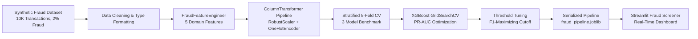

# 🛡️ Project 4: Credit Card Fraud Detection & Transaction Anomaly Screener

[](https://www.python.org/)
[](https://scikit-learn.org/)
[](https://xgboost.readthedocs.io/)
[](https://streamlit.io/)
[]()

> A production-grade Machine Learning fraud screening system tackling **extreme class imbalance** (2% fraud rate) with cost-sensitive classification, engineered risk features, and an interactive Streamlit real-time transaction screening dashboard. Demonstrates the most critical real-world ML challenge in financial technology: catching every fraudulent transaction while minimizing false positives on legitimate cardholders.

📖 **[Read the Pro Concepts & Technical Interview Guide](./CONCEPTS_AND_INTERVIEW_GUIDE.md)** for cost-sensitive loss derivations, PR-AUC vs. ROC-AUC mathematical proof, threshold economics, and top 10 interview Q&A.

---

## 📌 1. Business Problem & Objective

Credit card fraud costs the global financial industry over **$30 billion annually**. The core ML challenge is **extreme class imbalance** — fraudulent transactions represent less than 2% of all activity. A naive model that always predicts "legitimate" achieves 98% accuracy but catches zero fraud.

**Objective:**
Build a cost-sensitive classification pipeline that maximizes fraud detection recall while controlling false positive rates, and deploy an interactive real-time screening dashboard with explainable risk drivers for each transaction.

---

## 🧠 2. ML Concepts & Techniques Demonstrated

* **Extreme Class Imbalance Handling**: Only 2% of transactions are fraudulent — standard accuracy metrics are meaningless.
* **Cost-Sensitive Learning**: `class_weight="balanced"` (Logistic Regression, Random Forest) and `scale_pos_weight=50` (XGBoost) to penalize missed fraud heavily.
* **Feature Engineering** (5 domain-engineered features):
  * `Is_Night_Transaction`: Late-night fraud window flag (11 PM – 5 AM).
  * `Is_High_Distance`: Geo-anomaly indicator (>100 KM from billing address).
  * `Amount_Log`: Log-scaled transaction amount (handling extreme positive skew).
  * `High_Velocity_Flag`: Rapid card usage (>=5 transactions in 24h).
  * `High_Risk_Category`: Elevated-risk merchant categories (Online Retail, Luxury Goods, Travel).
* **Leakage-Free Pipelines**: Custom `FraudFeatureEngineer` transformer + `ColumnTransformer` (RobustScaler + OneHotEncoder) wrapped in a Scikit-learn `Pipeline`.
* **Model Benchmarking**: 5-Fold Stratified Cross-Validation across **Logistic Regression**, **Balanced Random Forest**, and **XGBoost**.
* **Primary Metric: PR-AUC (Average Precision)**: The gold standard for imbalanced classification — ROC-AUC can be misleadingly high when negatives dominate.
* **Hyperparameter Tuning**: `GridSearchCV` on XGBoost parameters (depth, learning rate, estimators, `scale_pos_weight`) optimizing PR-AUC.
* **Optimal Threshold Tuning**: F1-maximizing decision boundary search across the probability space.
* **Explainable Risk Drivers**: Human-readable per-transaction risk factor indicators.
* **Web Deployment**: Streamlit fraud screening dashboard with gauge charts, preset scenarios, and batch CSV screening.

---

## 🏗️ 3. Architecture & Data Flow



---

## 📊 4. Model Evaluation & Comparison

### Cross-Validation Benchmark (5-Fold Stratified, Training Set)

| Model | PR-AUC (Avg Precision) | ROC-AUC | Recall (Fraud Catch Rate) | Precision | F1-Score |
| :--- | :---: | :---: | :---: | :---: | :---: |
| **Cost-Sensitive Logistic Regression** | 0.8926 | 0.9868 | 93.12% | 37.70% | 0.5365 |
| **Balanced Random Forest** | 0.8687 | 0.9905 | 83.75% | 74.51% | 0.7883 |
| **XGBoost (Imbalanced Tuned)** 🏆 | 0.9017 | 0.9909 | 86.25% | 70.28% | 0.7737 |

### Test Set Performance (Held-out 20%)

| Metric | Value |
| :--- | :---: |
| **PR-AUC (Average Precision)** | `0.9429` |
| **ROC-AUC** | `0.9984` |
| **Optimal Decision Threshold** | `0.52` |
| **Fraud Detection Recall** | `87.50%` (35/40 frauds caught) |
| **Precision** | `85.37%` |
| **F1-Score** | `0.8642` |
| **Confusion Matrix** | TN=1954, FP=6, FN=5, TP=35 |

---

## 🔍 5. Key Fraud Risk Indicators (Feature Importance)

1. **Recent 24h Transaction Velocity** — `0.3920`: Rapid bursts of card activity are the strongest indicator of compromised credentials.
2. **High-Risk Merchant Category** — `0.1490`: Online Retail, Luxury Goods, Electronics, and Travel categories carry elevated fraud risk.
3. **Online Retail Merchant** — `0.0765`: The single most fraud-prone merchant category.
4. **Distance from Home (KM)** — `0.0670`: Geographic anomaly signal, but not dominant — 40% of fraud happens nearby.
5. **Hour of Day** — `0.0463`: Late-night transactions show mild fraud elevation but significant daytime overlap.

---

## 🖥️ 6. Streamlit Dashboard Features

1. **⚡ Live Transaction Risk Screening**:
   - Interactive sidebar: Amount, Hour, Distance, Merchant Category, Payment Channel, Card Brand, Velocity.
   - 1-click Preset Scenarios: *Compromised Card Burst*, *Legitimate Coffee Purchase*, *Suspicious Micro-Test Charge*, *Travel Airline Booking*.
   - Dynamic Plotly Gauge Chart displaying real-time fraud anomaly score.
   - Color-coded verdict badges: 🚨 DECLINE (>70%), ⚠️ STEP-UP AUTH (35-70%), ✅ APPROVED (<35%).
   - Explainable risk driver breakdown per transaction.

2. **📊 Imbalance Model Leaderboard & PR-AUC**:
   - Cross-validation benchmark table with highlighted best scores.
   - Test set metrics (PR-AUC, Recall, Precision, Confusion Matrix).
   - Top predictive features horizontal bar chart.

3. **📁 Batch Transaction Screening**:
   - CSV upload for bulk fraud screening.
   - Downloadable enriched results with fraud probability and decision columns.

---

## 🚀 7. How to Run Locally

### 1. Navigate to the project
```bash
cd 04-fraud-detection-screener
```

### 2. Install dependencies
```bash
pip install -r requirements.txt
```

### 3. Generate dataset & train the model
```bash
python src/data_loader.py   # Generates 10K synthetic transactions
python src/train.py          # Runs CV benchmark, tunes XGBoost, saves artifacts
```
This will:
- Generate a realistic imbalanced fraud dataset (10,000 transactions, 2% fraud rate).
- Run 5-fold stratified cross-validation across 3 candidate models.
- Tune XGBoost via GridSearchCV optimizing PR-AUC.
- Find the optimal fraud decision threshold.
- Save the trained pipeline to `models/fraud_pipeline.joblib` and metrics to `models/model_metrics.json`.

### 4. Test inference
```bash
python src/predict.py
```

### 5. Launch the Streamlit dashboard
```bash
streamlit run app.py
```

---

## 📂 8. Project Structure

```text
04-fraud-detection-screener/
├── data/
│   ├── raw/                          # Generated synthetic transaction dataset
│   └── processed/                    # Cleaned dataset
├── notebooks/
│   ├── 01_eda_and_imbalance.ipynb    # EDA: class distribution, feature analysis
│   └── 02_model_experimentation.ipynb # Model comparison & threshold analysis
├── src/
│   ├── __init__.py
│   ├── data_loader.py                # Synthetic fraud data generator & loader
│   ├── preprocessor.py               # FraudFeatureEngineer & ColumnTransformer
│   ├── train.py                      # CV benchmarking, tuning & serialization
│   └── predict.py                    # Inference, risk scoring & explainability
├── models/
│   ├── fraud_pipeline.joblib         # Production model artifact
│   ├── model_metrics.json            # Evaluation metadata
│   └── feature_importances.json      # Feature ranking
├── app.py                            # Streamlit fraud screening dashboard
├── requirements.txt                  # Project dependencies
└── README.md                         # Project documentation
```
