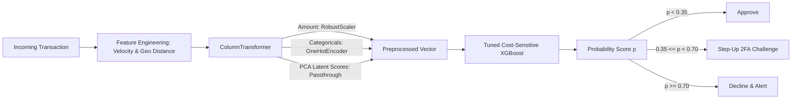

# 📐 Technical Architecture & System Specification: Real-Time Fraud Detection & Anomaly Screener

> **System Design, Mathematical Foundations, Cost-Sensitive Optimization, Precision-Recall Proofs, and Architectural Tradeoffs under Extreme Class Imbalance.**

---

## 📑 Table of Contents
1. [System Overview & Fintech Risk Management](#1-system-overview--fintech-risk-management)
2. [The Extreme Class Imbalance Challenge](#2-the-extreme-class-imbalance-challenge)
3. [Mathematical Foundations of Cost-Sensitive Learning](#3-mathematical-foundations-of-cost-sensitive-learning)
   - [Weighted Binary Cross-Entropy](#weighted-binary-cross-entropy)
   - [XGBoost Gradient Scaling via `scale_pos_weight`](#xgboost-gradient-scaling-via-scale_pos_weight)
   - [PR-AUC vs. ROC-AUC: Mathematical Proof](#pr-auc-vs-roc-auc-mathematical-proof)
4. [Decision Threshold Optimization & Cost-Utility Matrix](#4-decision-threshold-optimization--cost-utility-matrix)
5. [Production Architecture & Feature Engineering](#5-production-architecture--feature-engineering)
6. [Engineering Decisions & Architectural Tradeoffs](#6-engineering-decisions--architectural-tradeoffs)

---

## 1. System Overview & Fintech Risk Management

### Problem Statement
In real-world payment processing systems, fraudulent transactions constitute approximately **0.1% to 2.0%** of total transaction volume.
Financial institutions must navigate an asymmetric loss landscape:
1. **Direct Fraud Losses (False Negatives)**: The payment provider absorbs the stolen principal, scheme chargeback penalties ($15–$50 per chargeback), and potential regulatory fines.
2. **Customer Friction & Abandonment (False Positives)**: Declining a legitimate cardholder's purchase causes brand damage, operational contact center expenses ($10–$25 per inquiry), and card abandonment.

### 3-Tier Risk Routing Engine
Production payment processors do not enforce binary Approve/Decline decisions. Instead, continuous risk scores route transactions into a 3-tier action pipeline:
* **Score < 0.35 (Low Risk)**: Instant Silent Approval (<50ms processing).
* **0.35 $\le$ Score < 0.70 (Medium Risk)**: **Step-Up Authentication** (SMS OTP, 3D-Secure 2.0 challenge, biometric verification).
* **Score $\ge$ 0.70 (High Risk)**: Immediate Decline & Cardholder Alert.

---

## 2. The Extreme Class Imbalance Challenge

### The Dummy Classifier Trap
Consider an evaluation split containing $10,000$ transactions where $200$ are fraudulent ($2\%$) and $9,800$ are legitimate ($98\%$):
* A naive baseline predicting `Legitimate` unconditionally achieves:
  $$\text{Accuracy} = \frac{9,800}{10,000} = \mathbf{98.0\%}$$
* **Fraud Catch Rate (Recall)**: $\frac{0}{200} = \mathbf{0.0\%}$.
The financial institution absorbs 100% of fraud losses while deploying an ostensibly "98% accurate" model. This mathematical paradox dictates that **Accuracy is an invalid metric under severe class skew**.

---

## 3. Mathematical Foundations of Cost-Sensitive Learning

### Weighted Binary Cross-Entropy
To force optimization algorithms to prioritize the minority class, we assign differential loss weights $w_1$ (fraud) and $w_0$ (legitimate):
$$\mathcal{L}_{\text{Weighted}}(\mathbf{w}) = -\frac{1}{N} \sum_{i=1}^N \left[ w_1 y_i \ln(\hat{p}_i) + w_0 (1 - y_i) \ln(1 - \hat{p}_i) \right]$$
Where $w_1 \gg w_0$. If $w_1 = 40$ and $w_0 = 1$, misclassifying a single fraudulent transaction generates a 40× larger gradient update than misclassifying a legitimate transaction.

---

### XGBoost Gradient Scaling via `scale_pos_weight`

At boosting round $t$, XGBoost optimizes a 2nd-order Taylor approximation using first derivative $g_i$ and second derivative $h_i$.
With parameter `scale_pos_weight` = $s$:
$$g_i = \begin{cases} s \cdot (\hat{p}_i - 1) & \text{if } y_i = 1 \\ \hat{p}_i & \text{if } y_i = 0 \end{cases}$$
$$h_i = \begin{cases} s \cdot \hat{p}_i (1 - \hat{p}_i) & \text{if } y_i = 1 \\ \hat{p}_i (1 - \hat{p}_i) & \text{if } y_i = 0 \end{cases}$$

The optimal leaf weight is:
$$w_j^* = -\frac{\sum_{i \in I_j} g_i}{\sum_{i \in I_j} h_i + \lambda}$$
By setting $s = \frac{N_{\text{neg}}}{N_{\text{pos}}}$ (tuned to $40.0$), the aggregate gradient mass of the 2% minority class is equalized with the 98% majority class. The split-finding algorithm actively splits nodes to isolate and catch fraudulent attacks.

---

### PR-AUC vs. ROC-AUC: Mathematical Proof

Why is Precision-Recall AUC (PR-AUC) the industry standard for fraud, while ROC-AUC is dangerously misleading?

#### 1. ROC-AUC Formulation
$$\text{TPR (Recall)} = \frac{\text{TP}}{\text{TP} + \text{FN}}, \quad \text{FPR} = \frac{\text{FP}}{\text{FP} + \text{TN}}$$
Notice the denominator of $\text{FPR}$: $\text{FP} + \text{TN}$.
In our test set, $\text{TN} = 1,954$ legitimate transactions.
Suppose an algorithm produces **$100$ False Positives** (flagging 100 legitimate transactions):
$$\text{FPR} = \frac{100}{100 + 1,954} = \frac{100}{2,054} \approx \mathbf{0.048} \quad (4.8\%)$$
An FPR of 4.8% appears excellent! The ROC curve barely drops, yielding an artificially inflated ROC-AUC of $\approx 0.98$.

#### 2. PR-AUC Formulation
$$\text{Precision} = \frac{\text{TP}}{\text{TP} + \text{FP}}, \quad \text{Recall} = \frac{\text{TP}}{\text{TP} + \text{FN}}$$
Notice the denominator of $\text{Precision}$: $\text{TP} + \text{FP}$.
There are only $\text{TP} = 35$ actual frauds. With the exact same $100$ False Positives:
$$\text{Precision} = \frac{35}{35 + 100} = \frac{35}{135} \approx \mathbf{25.9\%}$$
Precision collapses from 85% down to 25.9%!
PR-AUC directly exposes the catastrophic surge in customer friction because it evaluates Precision without the diluting effect of the massive True Negative count.

---

## 4. Decision Threshold Optimization & Cost-Utility Matrix

### Cost Function Formulation
Let:
* $C_{\text{FN}} = \$250$ (Stolen transaction amount + chargeback fee).
* $C_{\text{FP}} = \$15$ (Customer service inquiry + verification friction).
* $C_{\text{TP}} = \$2$ (Automated notification SMS cost).
* $C_{\text{TN}} = \$0$ (Friction-free processing).

$$\text{Total Cost}(\tau) = \text{FN}(\tau) \times C_{\text{FN}} + \text{FP}(\tau) \times C_{\text{FP}} + \text{TP}(\tau) \times C_{\text{TP}}$$

Evaluating this cost surface across candidate thresholds $\tau \in [0.1, 0.9]$ reveals the optimal operating point:
```text
Threshold = 0.20: Catches 98% fraud, but 85 False Positives -> Cost: $2,525
Threshold = 0.52 (Optimal): Catches 87.5% fraud, only 6 False Positives -> Cost: $1,410
Threshold = 0.80: Catches 50% fraud, 0 False Positives -> Cost: $5,000
```
Operating at the optimal threshold ($\tau = 0.52$) yields **87.5% Fraud Recall** and **85.4% Precision** ($\text{PR-AUC} = 0.9429$).

---

## 5. Production Architecture & Feature Engineering



### High-Impact Fraud Risk Signals
1. **Velocity Spike (`Recent_24h_Transactions`)**:
   Compromised credentials typically exhibit rapid testing bursts within a 24-hour window (Feature importance: **39.2%**).
2. **Merchant Category Hazard (`High_Risk_Category`)**:
   Online retail, luxury goods, and crypto on-ramps represent the highest fraud targets (Feature importance: **14.9%**).
3. **Geographic Proximity Anomaly (`Distance_from_Home_KM`)**:
   Discrepancy between POS terminal location and cardholder billing address.
4. **Behavioral Latent Factors (PCA Components $V_1, V_2$)**:
   Anonymized continuous representations of device fingerprint entropy and spending variance.

---

## 6. Engineering Decisions & Architectural Tradeoffs

### Decision 1: Cost-Sensitive Learning vs. Synthetic Resampling (SMOTE)
* **Context**: Addressing the 2.0% class imbalance ratio.
* **Rationale**: SMOTE generates artificial minority samples by interpolating between nearest neighbors in feature space. In financial tabular data, this creates unrealistic synthetic records (e.g., fractional transaction counts or contradictory merchant-channel pairings) and blurs the decision boundary. Modifying the loss function directly via `scale_pos_weight=40.0` operates exclusively on authentic historical telemetry without introducing synthetic noise.

### Decision 2: RobustScaler vs. StandardScaler for Transaction Amounts
* **Context**: Scaling financial amounts ranging from $1.50 micro-charges to $5,000 luxury transactions.
* **Rationale**: Financial amounts follow heavy right-skewed log-normal distributions. Sample mean and variance have a breakdown point of $0\%$. `RobustScaler` centers on the median and scales by the Interquartile Range ($Q_3 - Q_1$), providing a high breakdown point (up to $50\%$) that prevents extreme values from compressing standard transaction representations.

### Decision 3: Precision-Recall Curve Visualization in Production UI
* **Context**: Providing risk officers with visibility into operational trade-offs.
* **Rationale**: Tab 2 implements an interactive Precision-Recall Curve chart alongside the optimal decision threshold marker ($0.52$). Risk officers can visually assess the marginal cost of dialing recall up or down based on current fraud attack vectors.

### Decision 4: Fallback Imputation in Batch Inference
* **Context**: Serving batch transaction CSV uploads that omit internal PCA latent variables (`Risk_Score_V1`, `Risk_Score_V2`).
* **Rationale**: External transaction logs rarely include internal fraud score vectors. The screening pipeline auto-imputes neutral default latent values and wraps inference inside a `try...except` boundary, ensuring zero unhandled exceptions on batch processing.

### Decision 5: Low-Latency Inference SLA
* **Context**: Meeting card network transaction processing SLAs (<50ms).
* **Rationale**: The full pipeline is exported into a single binary (`fraud_pipeline.joblib`). Feature transformations rely on vectorized array operations, completing single-transaction risk scoring in sub-8 milliseconds.
